# 视觉标注流程

本文根据《视觉标注流程.docx》整理，原始参考：[飞书文档](https://mcn8d3x6q1tz.feishu.cn/wiki/HxywwJzRciQEmykMYNwcYSFVnkh)。使用 X-AnyLabeling 完成 YOLO Mask（分割掩码）和 YOLO Keypoint（关键点）标注，并分别导出交付。

## 1. 下载与启动

- 软件版本：X-AnyLabeling v3.3.5。
- Linux CPU 版直接下载：[X-Anylabeling-Linux-CPU](https://github.com/CVHub520/X-AnyLabeling/releases/download/v3.3.5/X-Anylabeling-Linux-CPU)。
- 其他安装包：[GitHub v3.3.5 发布页面](https://github.com/CVHub520/X-AnyLabeling/releases/tag/v3.3.5)。

Linux 下载完成后，在文件所在目录打开终端，赋予执行权限并启动：

```bash
chmod +x X-Anylabeling-Linux-CPU
./X-Anylabeling-Linux-CPU
```

## 2. 导入数据与标注配置

准备图像文件夹、物体类别列表 TXT 和关键点配置 YAML。这里的类别列表 TXT 只记录物体名，不是导出后每张图片对应的标注 TXT。

1. 通过 **File → Open Dir** 打开需要标注的图像文件夹。
2. 通过 **Upload → Upload YOLO-Seg Annotations**，按提示选择对应的物体类别列表 TXT。
3. 通过 **Upload → Upload YOLO-Pose Annotations**，按提示选择对应的 YAML，其中包含物体类别和各类别的关键点定义。

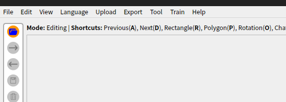

### 类别与关键点要求

- TXT、YAML 中的物体顺序和实际打标顺序必须严格一致。按原流程要求，第一个物体如 `cabinet` 对应 ID 为 `0`，后续依次排列。
- 除柜子、咖啡机、水杯等特殊物体外，关键点名称通常使用 `物体名_centre`；特殊物体的关键点以任务 YAML 定义为准。
- 柜子应拆分为**柜子主体**和**柜子抽屉**，分别进行掩码与关键点标注。原文示例中对应 `cabinet` 和 `drawer`，关键点分别为 `cabinet_centre` 和 `drawer_handle`。
- 下图是原文的配置示例，实际任务应使用对应的类别列表和关键点配置。

物体类别列表 TXT 示例：

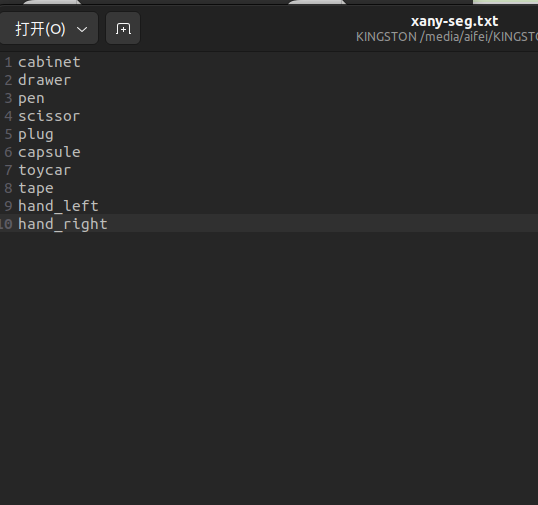

关键点配置 YAML 示例：

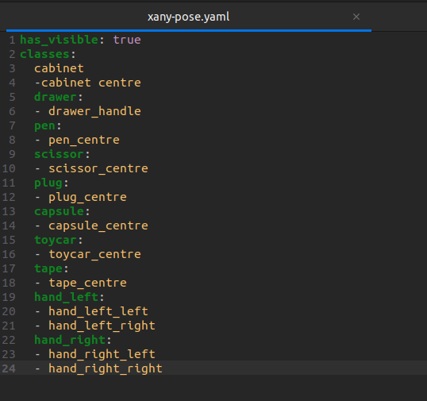

## 3. YOLO Mask 标注

1. 选择左侧工具栏中的 **AI** 选项。
2. 在左上角模型搜索中搜索 `SAM`，选择 **Segment Anything 2.1（Large）**。
3. 选择 **+Rect**，框选需要标注的物体。
4. 点击 **Finish**，或按快捷键 **F**，完成当前分割并填写物体标签。
5. 检查分割轮廓和类别，按任务类别列表继续标注其他物体。

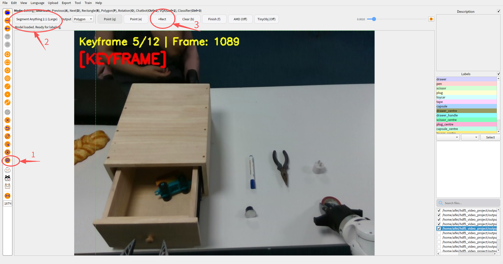

**遮挡处理：**按本任务原文要求，当物体被其他物体部分遮挡、遮挡程度低于 50% 时，Mask 需要还原出完整的物体轮廓。原文未规定遮挡达到或超过 50% 时的处理方式。

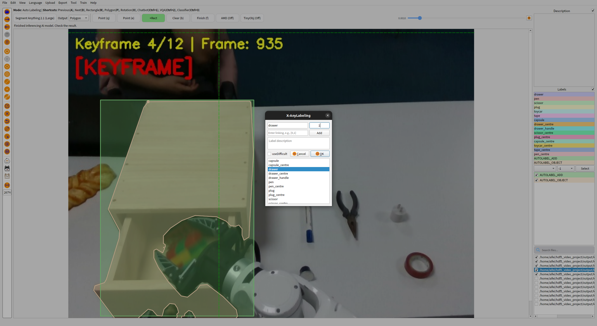

## 4. YOLO Keypoint 标注

1. 退出 **AI** 模式，进入手动标注模式。
2. **先为目标物体绘制矩形框**，确定关键点所属的物体范围。
3. 再在对应矩形范围内标注关键点，名称按 YAML 配置填写。
4. 检查物体框、关键点及其 ID 对应关系。

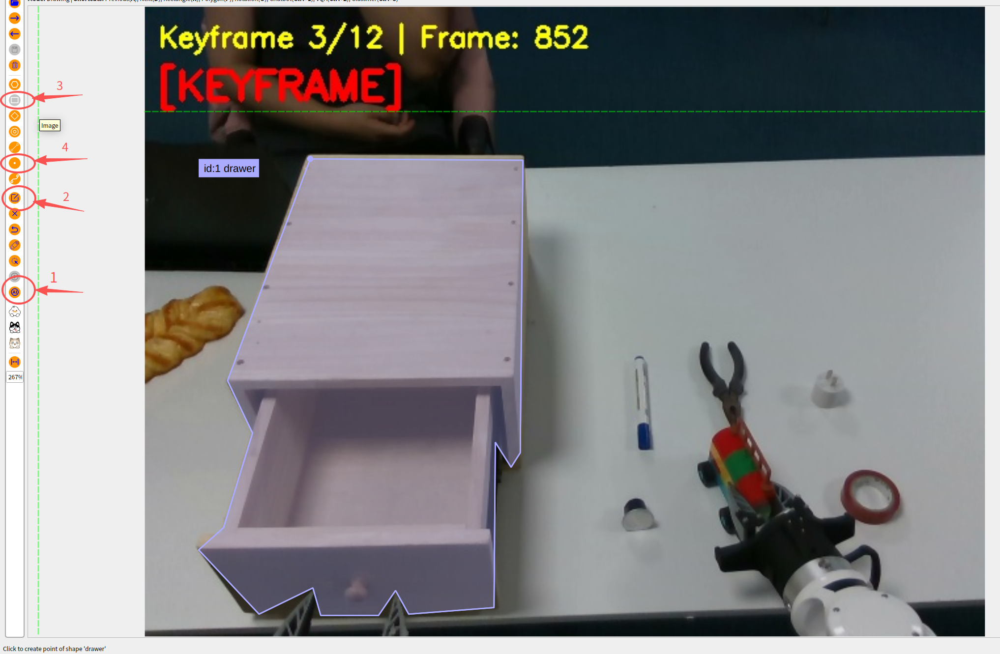

**必须先画物体矩形框，再标关键点。**原文指出，未先创建矩形框是关键点无法正常导出的常见原因；遇到导出问题时，优先检查这一点。

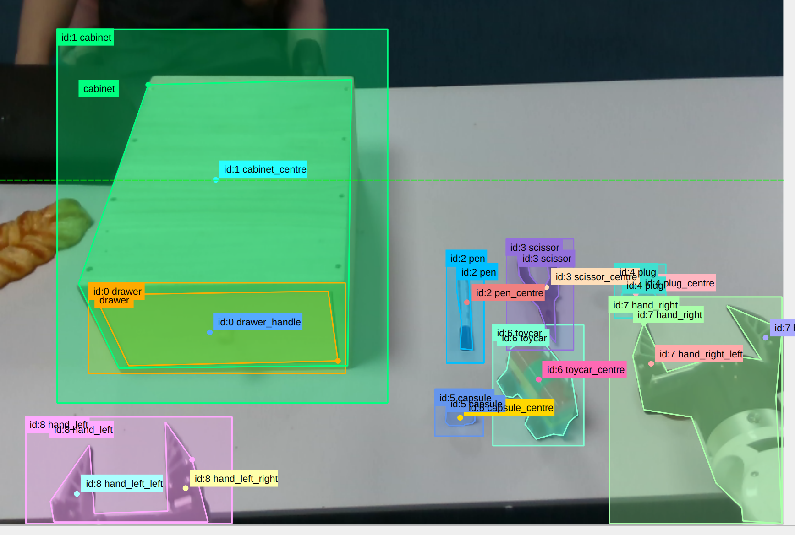

## 5. 保存与导出

### 5.1 导出 YOLO Mask

1. 选择 **Export → Export YOLO-Seg Annotations**。
2. 再次选择第 2 节导入时使用的物体类别列表 TXT。
3. 选择独立的 Mask 输出文件夹，如 `Taskname_Mask`。
4. 仅导出标签内容，下面两个选项均**不勾选**：
   - **Save with images?**
   - **Skip empty labels?**

### 5.2 导出 YOLO Keypoint

1. 选择 **Export → Export YOLO-Pose Annotations**。
2. 再次选择第 2 节导入时使用的关键点配置 YAML。
3. 选择独立的 Keypoint 输出文件夹，如 `Taskname_Keypoint`。
4. 同样仅导出标签内容，**Save with images?** 和 **Skip empty labels?** 均**不勾选**。

两类导出的选项设置相同：

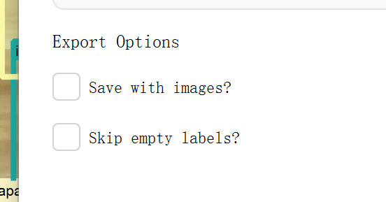

### 5.3 保存图像与 JSON

单独保留原始图像及对应的 X-AnyLabeling JSON 标注文件，供后续查看和修改。交付时需要同时保留：

| 内容 | 保存位置 |
| --- | --- |
| 原始图像与 JSON 标注 | 图像文件夹 |
| YOLO Mask 标注 TXT | 独立的 Mask 文件夹 |
| YOLO Keypoint 标注 TXT | 独立的 Keypoint 文件夹 |

**Mask 与 Keypoint 必须保存在两个不同的文件夹中**，避免同名 TXT 相互覆盖。原文通用命名为 `Taskname_Mask`、`Taskname_Keypoint`，下面交付示例使用小写后缀；同一批次应统一命名方式。

## 6. 交付文件示例

假设共有 5 组图像，以第 1 组 `01` 为例，需要交付以下三个文件夹：

```text
交付目录/
├── 01/                    # 原始图像与 JSON 标注
│   ├── frame_01.png
│   ├── frame_01.json
│   ├── frame_02.png
│   └── frame_02.json
├── 01_keypoint/           # YOLO Keypoint 标注
│   ├── frame_01.txt
│   └── frame_02.txt
└── 01_mask/               # YOLO Mask 标注
    ├── frame_01.txt
    └── frame_02.txt
```

其余各组按相同结构保存为 `02`、`02_keypoint`、`02_mask` 等，直至第 5 组。全部整理后，将所有交付文件夹压缩打包。

文件汇总示例：

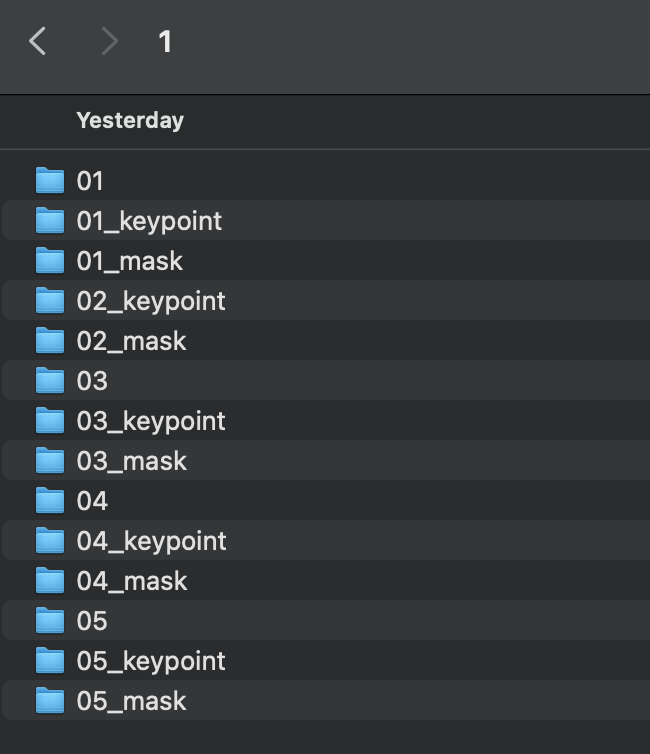

`01`：原始图像与 JSON 标注文件。

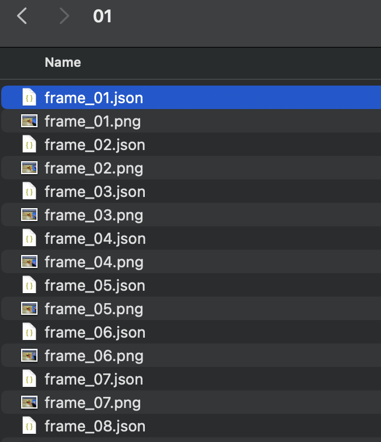

`01_keypoint`：每张图像对应的关键点 TXT。

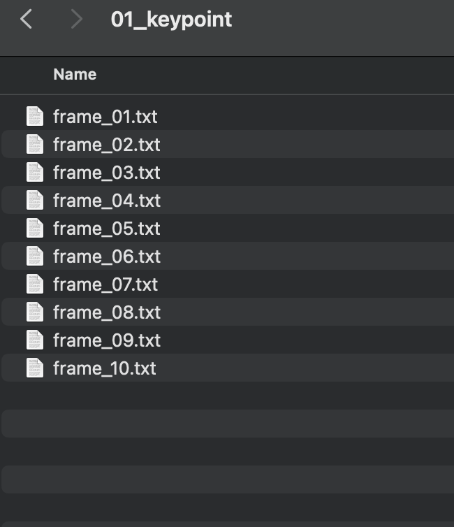

`01_mask`：每张图像对应的掩码 TXT。

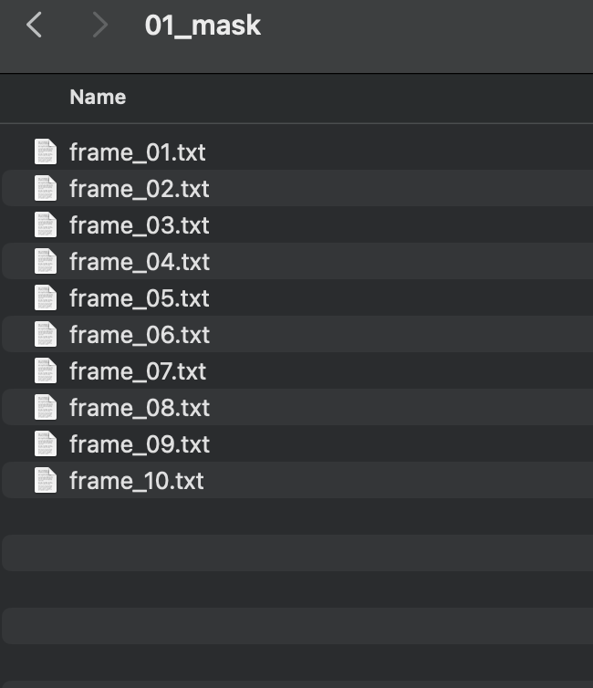
